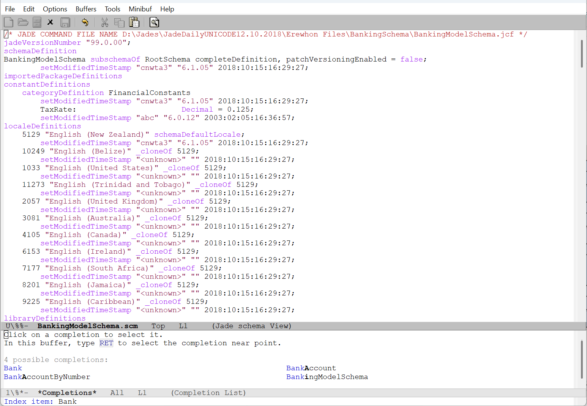

# Jade Schema mode

Font-lock and navigation support for Jade Platform schema files in Emacs.


Navigating a Jade [example
schema](https://github.com/jadesoftwarenz/JADE-Banking-Schema) file with
`jade-schema-mode`.

[Jade](https://www.jadeplatform.com/) is a platform for developing and operating
Windows database applications. Jade is characterised by its deep integration of
proprietary components: pretty much everything is Jade's own, including
database, application server, programming language, UI builder and - yes - even
IDE/text editor.

Whilst Jade applications are always written inside the Jade Platform environment
using Jade's own IDE, the _schemas_ that comprise applications can be exported
as plain text files and viewed in an editor of your choice. `jade-schema-mode`
provides basic Emacs capabilities for navigating a schema file:

- `view-mode` for paging through a schema,
- an `imenu` index for quick navigation to a type's header, definition or
  sources,
- an `outline` definition for jumping to named sections in the schema.

## Installation

Installation is manual. Add these lines to your config:

```lisp
(autoload 'jade-schema-mode "/path/to/jade-schema-mode/jade-schema-mode.el" nil t)
(add-to-list 'auto-mode-alist '("\\.scm\\'" . jade-schema-mode))
```

## Testing

This package has tests in the `test/` directory. Run the tests with `make`.

During development it may be more convenient to use `M-x
ert-run-tests-interactively`.
